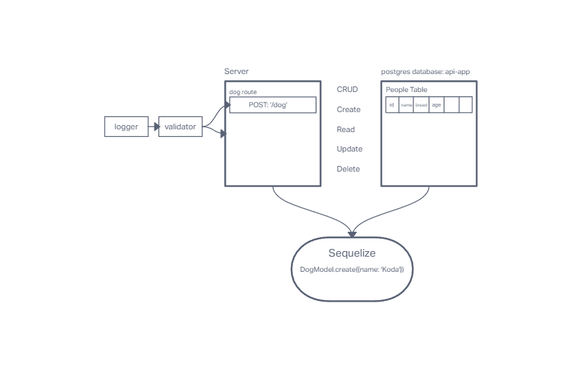

# Project: Basic API Server

## Author: Tyler Main

### Code 401d48 Lab 03

### Problem Domain

Build a REST API using Express, by creating endpoints that perform CRUD operations on a database.

### UML

